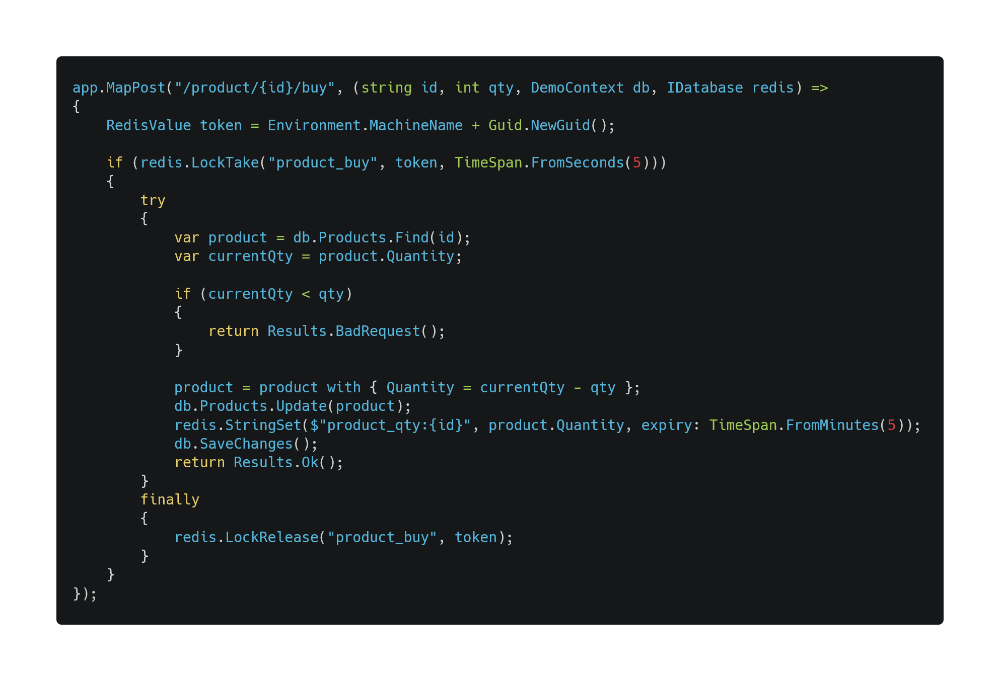

<!-- _class: 'invert' -->
<!-- _header: '' -->
<!-- _paginate: skip -->

# Infinitely scalable apps with Actors*

  

    </img>
  

  

    <h4>Fabio Di Peri</h4>
    <h6>Head of IT @ Corax</h6>
  

  

    <ul>
      <li>
        <a>
          <i class="fa-brands fa-telegram"></i>
          @kipters
        </a>
      </li>
      <li>
        <a>
          <i class="fa-brands fa-twitter"></i>
          @kipters
        </a>
      </li>
      <li>
        <a>
          <i class="fa-brands fa-linkedin"></i>
          @fabiodiperi
        </a>
      </li>
      <li>
        <a>
          <i class="fas fa-envelope"></i>
          fabio@kipters.dev
        </a>
      </li>
    </ul>
  

  

    
* (almost)

  

---

# Agenda

- Cos'è un actor?
- Perché infinitamente scalabile?
- Perché quasi infinitamente scalabile?
- Perché non se ne sente parlare?

---

# Cos'è un actor?

> The actor model […] is a […] model of concurrent computation that treats an actor as the universal primitive of concurrent computation. 
In response to a message it receives, an actor can: make local decisions, create more actors, send more messages, and determine how to respond to the next message received. Actors may modify their own private state, but can only affect each other indirectly through messaging (removing the need for lock-based synchronization)

---

<!-- _class: 'lead invert' -->

# Actor = identity + behavior [+ state]

---

# Actor = identity + behavior [+ state]

- Lo stato di un actor può essere modificato solo dall'actor stesso
- Comunica con l'esterno inviando e ricevendo messaggi
- (Generalmente) single threaded
- (Generalmente) il framework da garanzie sull'unicità
- Più copie dello stesso actor esistono con identità diverse
- Possono essere/sono self-healing

---

# Actor = identity + behavior [+ state]

- Lo stato di un actor può essere modificato solo dall'actor stesso
- Comunica con l'esterno inviando e ricevendo messaggi
- (Generalmente) single threaded
- (Generalmente) il framework da garanzie sull'unicità
- Più copie dello stesso actor esistono con identità diverse
- Possono essere/sono self-healing
- **Possono essere fisicamente in qualunque nodo del cluster**

---

---

<!-- _class: -->

  </img>
  </img>
  </img>
  </img>

---

<!-- _class: 'lead invert' -->

# Demo

---

<!-- _class: 'lead invert' -->

# Demo

Un'API per leggere e aggiornare un prodotto
con C# e Orleans

---

<!-- _class: 'lead invert' -->

---

<!-- _class: 'lead invert' -->

--- 

<!-- _class: 'lead invert' -->

--- 

<!-- _class: 'lead invert' -->

--- 

<!-- _class: 'lead invert' -->

--- 

<!-- _class: lead -->

# Ora con gli actor

---

<!-- _class: 'lead invert' -->

--- 

<!-- _class: 'lead invert' -->

--- 

<!-- _class: 'lead invert' -->

--- 

<!-- _class: 'lead invert' -->

--- 

<!-- _class: 'lead invert' -->

--- 

<!-- _class: 'lead invert' -->

---

<!-- _class: '' -->

### Links

https://github.com/kipters/beer-and-tech-4-slides
https://www.erlang.org/
https://learn.microsoft.com/en-us/dotnet/orleans/
https://akka.io/
https://getakka.net/
https://www.youtube.com/watch?v=8duFuggnj8o

---

<!-- _paginate: skip -->

# 👋

  

    <ul>
      <li>
        <a>
          <i class="fa-brands fa-telegram"></i>
          @kipters
        </a>
      </li>
      <li>
        <a>
          <i class="fa-brands fa-twitter"></i>
          @kipters
        </a>
      </li>
      <li>
        <a>
          <i class="fa-brands fa-linkedin"></i>
          @fabiodiperi
        </a>
      </li>
      <li>
        <a>
          <i class="fas fa-envelope"></i>
          fabio@kipters.dev
        </a>
      </li>
    </ul>
  

